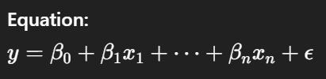

Definition:
  Linear Regression models the relationship between a dependent variable and one or more independent variables using a linear equation.

Use Case:
Predicting continuous variables like prices, temperatures, etc.

Assumptions:
Linearity, independence, homoscedasticity, normality of residuals.
