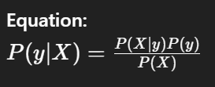

Definition: 
	A probabilistic classifier based on Bayes’ theorem, assuming independence between features.

 
Types: 
	Gaussian (for continuous data) 
	Multinomial (for discrete counts) 
	Bernoulli (for binary features)

Use Case: 
	Text classification, sentiment analysis.
